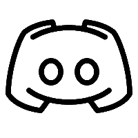

### Hi there, I'm Aabhash 👋
 

 

## I'm a Full-Stack Developer, Penetration Tester and Freelancer!!

- 🔭 I’m currently working on [**`weddingduniya`**](https://github.com/aamware/Weddingduniya)
- 🌱 I’m currently learning everything 🤣
- 👯 I’m looking to collaborate with other developers
- 🥅 2022 Goals: Gain experience with work 💸 and achieve oscp cetificate
- ⚡ Fun fact: I love to watch anime and ride bike 🏍️

### Connect with me:

 

 

### Languages and Tools:
&nbsp;

 
 

---

### ⚡Github Stats

### **Support Me**

 

